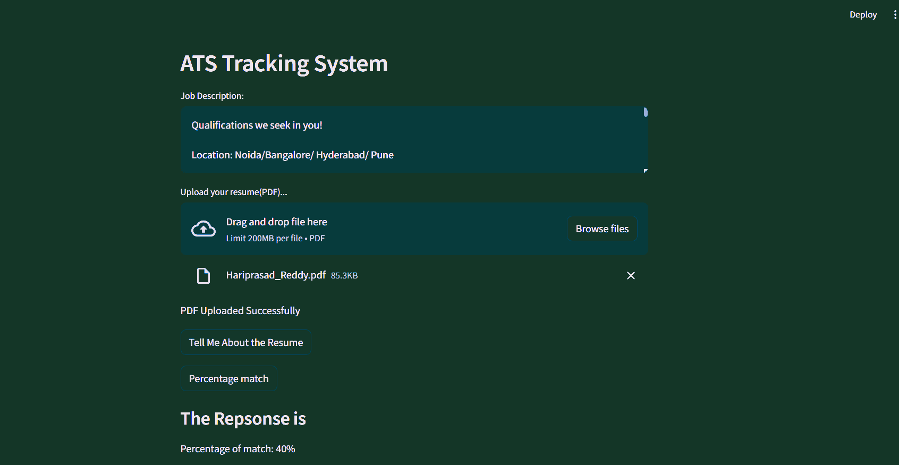

# Application Tracking System Using Google's Gemini Pro

## Introduction
------------
The Streamlit App is a Python application which works as an application tracking system
## How It Works
------------



The application follows these steps to provide responses to your questions:

1. JOb Description : Takes input of the jd with which it has to compare the uploaded resume.

2. Resume uploading: The app reads the uploaded resume document and extracts its text content.

3. Language Model: The application utilizes a language model specifically Google's ge,ini pro to compare the resume with jd.

4. Similarity Matching: When you ask a question, the app compares it with the text chunks and identifies the most semantically similar ones.

5. Response Generation: The selected chunks are passed to the language model, which generates a response based on the relevant content of the PDFs.

## Dependencies and Installation
----------------------------
To install the MultiPDF Chat App, please follow these steps:

1. Clone the repository to your local machine.

2. Install the required dependencies by running the following command:
   ```
   pip install -r requirements.txt
   ```

3. Obtain an API key from OpenAI and add it to the `.env` file in the project directory.
```commandline
OPENAI_API_KEY=your_secrit_api_key
```

## Usage
-----
To use the MultiPDF Chat App, follow these steps:

1. Ensure that you have installed the required dependencies and added the OpenAI API key to the `.env` file.

2. Run the `main.py` file using the Streamlit CLI. Execute the following command:
   ```
   streamlit run app.py
   ```

3. The application will launch in your default web browser, displaying the user interface.

4. Load multiple PDF documents into the app by following the provided instructions.

5. Ask questions in natural language about the loaded PDFs using the chat interface.

## License
-------
The MultiPDF Chat App is released under the [MIT License](https://opensource.org/licenses/MIT).